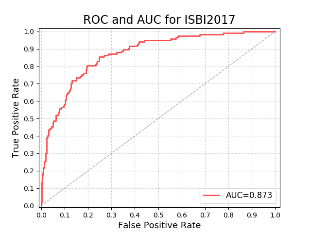

# [Attention Residual Learning for Skin Lesion Classification](https://ieeexplore.ieee.org/document/8620285)

## Introduction

This work is an unofficial code implemented by Pytorch. Some issues are different with original paper:

* We don't employed additional dermoscopy images which is collected in ISIC Archive.
* The data augment isn't same with original paper but the performance of our work is approximative.

## Preparation

First of all, clone the code
```
https://github.com/Vipermdl/ARL
```

Then, create a folder for dataset:
```
cd ARL && mkdir data
```

Note: We currently only support [ISIC 2017](https://challenge.kitware.com/#challenge/583f126bcad3a51cc66c8d9a). To make things easy, we provide simple dataset loader that inherits `torch.utils.data.Dataset` making it fully compatible with the `torchvision.datasets` [API](http://pytorch.org/docs/torchvision/datasets.html).

A soft-link is recommended. 
```
ln -s /path/to/isic2017 ./data/isic2017
```

Then, we sliced the images for patches to train:
```
python generate_patch_images.py
```

It should have this basic structure
```Shell
$ISIC2017/
$ISIC2017/ISIC-2017_Test_v2_Data/
$ISIC2017/ISIC-2017_Training_Data/
$ISIC2017/ISIC-2017_Validation_Data/
$ISIC2017/ISIC-2017_Training_Data_Patch/
$ISIC2017/ISIC-2017_Test_v2_Part3_GroundTruth.csv/
$ISIC2017/ISIC-2017_Training_Part3_GroundTruth.csv/
$ISIC2017/ISIC-2017_Validation_Part3_GroundTruth.csv/
$ISIC2017/ISIC-2017_Training_Part3_GroundTruth_patch.csv/
```

## prerequisites

* Python 3.6
* Pytorch 0.4.0 or higher
* CUDA 8.0 or higher
* Install all the python dependencies using pip: pip install -r requirements.txt

## Train 

```
python train_mel.py
```

## Test 

```
python predict2017_mel.py
```

## Performance Comparision

We re-implemented with ARLNet50 for the task of Melanoma Classification: 

|Work|params|AUC|ACC|Sensitivity|Specificity| 
|---|---|---|---|---|---|
|Original paper|2.3|0.875|0.850|0.658|0.96| 
|Our work|2.35|0.872|0.850|0.487|0.937| 

Below is AUC figure:

<div style="color:#0000FF" align="center">
 
</div>

## Authorship

This repository is produced by [Dongliang Ma](https://github.com/Vipermdl), if you have any question, please contact with me.
